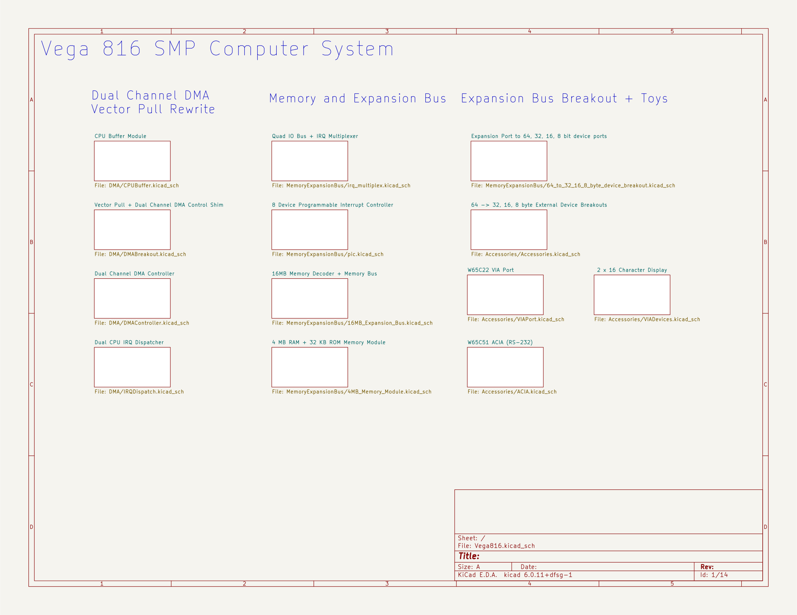

# Vega816 - Dual 65C816 Computer with Vector Pull rewrite

## Table of Contents

* [Functional Description](#functional-description)
    * [Limitations of the Design](#limitations-of-the-design)
* [CPU Buffer Board](#cpu-buffer-board)
* [DMA Control and Vector Pull Rewrite Shim](#dma-control-and-vector-pull-rewrite-shim)
    * [DMA Control Shim](#dma-control-shim)
    * [Vector Pull Rewrite Shim](#vector-pull-rewrite-shim)
    * [Offset of 7 triggers RESB interrupt handler for W65C816](#offset-of-7-triggers-resb-interrupt-handler-for-w65c816)
    * [Details of Vector Pull address rewriting](#details-of-vector-pull-address-rewriting)
    * [Effect of Vector Pull Rewrite in Emulation (65C02) Mode](#effect-of-vector-pull-rewrite-in-emulation-65c02-mode)
* [IRQ Dispatcher](#irq-dispatcher)
    * [IRQ Priority 7 to NMI Option](#irq-priority-7-to-nmi-option)
* [DMA Controller](#dma-controller)
* [Quad 64B I/O Bus](#quad-64b-i-o-bus)
    * [Combining IRQs from Multiple Expansion Bus Controllers](#combining-irqs-from-multiple-expansion-bus-controllers)
   
* [Programmable Interrupt Controller (PIC)](#programmable-interrupt-controller-pic)
    * [2 Device PIC](#2-device-pic)
    * [Quad 2-Device PIC](#quad-2-device-pic)
* [16 MB Memory Decoder and Bus](#16-mb-memory-decoder-and-bus)
* [4 MB RAM + 32 K EEPROM Module](#4-mb-ram-32-k-eeprom-module)
* [Expansion Port to Single Device Ports](#expansion-port-to-single-device)
* [Single Device Port Breakouts](#single-device-port-breakouts)
* [Devices](#devices)
    * [W65C22 VIA Port](#w65c22-via-port)
    * [W65C51N ACIA (RS-232)](#w65c51n-acia-rs-232)
    * [8580/6581 SID](#8580-6581-sid)

* [VIA Port Devices](#via-port-devices)
    * [2x16 Character Display and front panel switches](#2x16-character-display-and-front-panel-switches)
    * [System Controller / SPI Controller](#system-controller-spi-controller)
    * [Ben Eater PS/2 Interface](#ben-eater-ps-2-interface)
    * [Commodore 64 CIA (VIA) #1](#commodore-64-cia-via-1)


    
## Functional Description

The Vega816 is a modular architecture for implementing symmetrical multiprocessing (SMP) with the Western Design Center W65C816 Microprocessor (aka 65816). The project takes as its starting point the 65816 breakout board designed by Adrien Kohlbecker, documented at [the project's GitHub page](https://github.com/adrienkohlbecker/BB816) as well as [Adrien's YouTube series](https://www.youtube.com/playlist?list=PLdGm_pyUmoII9D16mzw-XsJjHKi3f1kqT).

The system also includes a programmable interrupt controller (PIC), which can be configured at runtime to direct IRQ interrupts from any device to one or the other connected CPU, at any of 8 different levels of priority (0-7, lower number is higher priority). If multiple interrupts are asserted at once, the interrupt with lowest priority wins.
When the target CPU fetches the interrupt vector, the system adds an offset to the low byte of the fetch equal to twice the priority number (since an interrupt vector is two bytes in length).

I/O address decoding is provided on 8-byte boundaries. Devices may span up to eight such 8-byte address ranges, for a maximum device address width of 64 bytes.

Memory modules are provided to provide RAM and ROM services. ROM can be separately banked in for read or write, or completely banked out for higher clock speeds.

Single Page I/O Bus boards perform address decoding to provide four 64-byte expansion slots, each provided with four chip select signals on 16 B boundaries. Programmable Interrupt Controllers introduce a further layer of address decoding to 8 byte boundaries.

A Single Page I/O board may be set, via jumper, to occupy any even-numbered page in the lowest 32 KB of its DMA channel's address space (i.e., any even numbered page between page $00 and page $7E). The next higher odd-numbered page is used by one or more programmable interrupt controllers to store programmed IRQ priority levels and CPU targets for each device.

The Programmable Interrupt Controller performs further subdivision of the 16 byte device granularity of the Expansion Bus into 8 byte device address spaces, such as used by the W65C51 ACIA.

Sample devices are provided, such as the ACIA (RS-232 serial port), and a VIA Port exposing the outward-facing pins of a W65C22 VIA in a standard connector format.

Finally, a reference System Controller based on the VIA Port is presented, allowing software control over system hardware, such as clock speed, CPU, EEPROM banking, and DMA control. 



### Limitations of the Design

A maximum of two CPUs are supported running against a maximum of two DMA channels. 

Introducing additional CPUs and DMA channels (say three, or four, of each) also necessarily increases the complexity of not only the DMA controller, but the programmable interrupt controller as well, requiring additional state and logic to route an IRQ among the increased number of CPUs sharing the channel. A benefit of this increase would be to introduce the possibilities of arbitrarily larger multiprocessor topologies in one or two dimensions.

A good deal of signal demultiplexing that is now performed with NAND gates could probably be done more simply using diode logic, perhaps using 1N5817 Schottky diodes.

## CPU Buffer Board

The CPU Buffer board provides two straight-wired connectors for the BB816 CPU breakout board, called "the CPU end", and buffers communications between the two of them and dual output connectors with the same pinout, called "the DMA end".

The extra straight wired connectors are included for ease of stacking the boards, both on the CPU end, and on the DMA end, in a multiplexed configuration, to implement shared memory multiprocessing. 

The circuit uses a 74AHCT245 octal bus transceiver for bi-directional communication for the 8 data lines, and seven 74HC541 octal buffers for the remaining signals provided by the BB816 CPU breakout board, including VPA and VDA. One of the buffers is allocated to CPU inputs (NMIB, IRQB, ABORTB, RDY_IN, etc), buffering signals from the DMA end. The remaining 74HC541s buffer lines from the CPU end onto the DMA end.

The bus transceiver and buffers' output enable lines are tied together and provided as an active low input called DMAB, so that a single signal suffices to turn communication on and off. A 1K pulldown resistor ensures that the board is active unless DMAB is raised high by external hardware.


## DMA Control and Vector Pull Rewrite Shim

If we assign each DMA channel its own address space, we can use address decoding in order to select which DMA channel is to be accessed by a particular CPU. In order to do that, we need to intercept the address lines from the CPU, pass decoding information to the DMA controller, and potentially rewrite the address being asserted by the CPU, before granting the CPU buffer access to the correct DMA channel.

The W65C816's VPB (Vector Pull) line also allows rewriting of the address asserted by the CPU when it is pulling an interrupt vector. It is convenient to provide hardware to intercept and rewrite the vector pull address as part of the same adapter.

Together, the DMA Control Shim and the Vector Pull Rewrite Shim provide facilities for DMA control and Vector Pull Rewrite to be performed by external hardware. 


### DMA Control Shim

The DMA Control shim provides movable jumpers for each of the bits A16-A23. Any of the bits may be selected as DMA_REQ. Once the jumper has been set to select one of those lines, it is connected as the DMA_REQ output, and disconnected from output to the DMA end, and is in fact pulled low on the DMA end (10K resistor), in order to map the request into a lower part of the DMA channel's address space.

The jumper offers the user a choice of granularity of DMA channel address mapping, in multiple of 2 increments from 64K (single bank, the minimum granularity) to 4M maximum. This allows for the address space to be contiguous across all DMA channels, depending on installed memory sizes. Ordinarily, this jumper should be set to the size of the maximum address space serviced by the hardware on either DMA channel, e.g. the total installed memory on that channel, or half the total memory across the two channels.

### Vector Pull Rewrite Shim

The Vector Pull Rewrite shim allows the IRQ Dispatcher to alter the fetch address of the processor when it is fetching an IRQ vector. A three bit number between 0-7 is added to the least significant bits (but one) of the fetch address, A1-A3, with carry into A4.

The VPB line is brought active low by the 65C816 during the fetch of any interrupt vector, not just IRQ. However, the standard IRQ vector's address has a unique bit pattern which makes it easy to autodetect, so that the shim will only request a vector pull offset when fetching the IRQ vector, and not for any other kind of interrupt.

When VPB is active (low) and A1-A3 are all high, indicating that an interrupt vector is being fetched by the processor, the shim requests a vector pull offset from the IRQ Dispatcher by asserting VP_REQ (positive logic). Pulldown resistors keep the offset equal to zero when Y0-Y2 are not connected (no IRQ Dispatcher) or in a high impedance state. 

A 74HC283 adder is used to add an offset to A1-A4 equal to the three bit number provided as input to the shim from the IRQ Dispatcher, on pins Y0-Y2. This has the effect of altering the fetch of the IRQ vector at $FFEE to a fetch of a vector at one of the following eight addresses: 
```
$00FFEE IRQ 0 
$00FFF0 IRQ 1 
$00FFF2 IRQ 2 
$00FFF4 IRQ 3 
$00FFF6 IRQ 4 
$00FFF8 IRQ 5 
$00FFFA IRQ 6 
$00FFFC RESET 
```
Y0-Y2 are pulled low by 10K resistors, for cases in which no Vector Pull controller is connected. Bypass jumpers are also provided for A1-A4, in case the 74HC283 adder and supporting logic are not installed.

The connector for the external Vector Pull Rewrite controller provides the E signal from the CPU, so that the Vector Pull Rewrite controller can know which scheme of vector pull (W65C02, W65C816) is being used.

#### Exposure of NMI and IRQ

The Vector Pull Rewrite shim exposes both IRQ and NMI to the IRQ Dispatcher. 

If the IRQ Dispatcher is not installed, a jumper on the Quad 64 IO Bus (IRQ Dispatch Bypass) should be installed to route IRQs to the common IRQ signal on the CPU via the CPU Buffer's DMA Channel connector.

When the IRQ Dispatcher is installed, the dispatcher takes responsibility for issuing IRQ to the CPU, via the Vector Pull Rewrite shim.

The exposure of NMI allows a device to raise an  IRQs at a selected IRQ priority level (say, IRQ 7) and instead trigger NMI, as the Commodore 64 RESTORE key did. The assertion of NMI is left under the control of the IRQ Dispatcher.

In scenarios where the IRQ Dispatcher is not installed, a jumper on the Quad 64B IO Bus (NMI Dispatch Bypass) can be used to direct IRQA7, IRQB7, both, or neither, to NMI.

#### Offset of 7 triggers RESB interrupt handler for W65C816

Note that, when the 65816 is running in native mode, if an IRQ priority of 7 (0x111) is asserted on Y0-Y2, the vector offset will result in the RESET vector being pulled. Since no actual hardware reset has occurred, if the reset handler relies on a hardware reset having taken place, unpredictable state may occur. It is generally advised to avoid the use of IRQ priority 7 when the CPU is in native mode. Alternatively, IRQ priority 7 may be rerouted to NMI, either through the IRQ Dispatcher, or a jumper on the Quad 64B IO Bus.

#### Details of Vector Pull address rewriting
The W65C816 datasheet gives this table of interrupt vectors which lie between $00FFE4 and $00FFFC
```
Address Function Last Octet (binary)
$00FFE4 COP      0x1110 0100
$00FFE6 BRK      0x1110 0110
$00FFE8 ABORT    0x1110 1000
$00FFEA NMI      0x1110 1010
$00FFEE IRQ      0x1110 1110
$00FFFC RESET    0x1111 1100
```
The datasheet also specifies that when the 65C816 is addressing an interrupt vector, it pulls its VPB line low. This is to allow the system to override the fetched interrupt vector with any other. 

VPB is pulled low for any interrupt vector fetch, not just IRQ, but the present design purposefully limits Vector Pull rewriting to only those cases when IRQ is the vector being fetched.

Note that the last nybble of each of the standard interrupt vectors is unique, which aids in designing a hook for any one of them (the same is true for 6502 Emulation mode, see below). A test of these four bits suffices to uniquely identify the vector being pulled. In particular, both bytes of the two-byte IRQ vector ($FFEE and $FFEF) are the only two bytes in this table with $E or $F (0x1110, 0x1111) as the last nybble of address, i.e., A1-A3 high.

Note also the gap of 12 bytes between the IRQ vector and the RESET vector. Since each vector occupies two bytes, this gap provides sufficient space to specify six (6) additional vectors. 

```
$00FFE4 COP	
$00FFE6 BRK
$00FFE8 ABORT 
$00FFEA NMI 
$00FFEE IRQ 0 
$00FFF0 IRQ 1 
$00FFF2 IRQ 2 
$00FFF4 IRQ 3 
$00FFF6 IRQ 4 
$00FFF8 IRQ 5 
$00FFFA IRQ 6 
$00FFFC RESET 
```
If an offset 0-6 is added to A1-A3, (leaving A0 as found), then the vector fetched will be as shown above, going forward from IRQ0.

#### Effect of Vector Pull Rewrite in Emulation (65C02) Mode
The 6502's IRQ vector, like its 65816 counterpart, has 0x111x in the last nybble, so it is detected by the Vector Pull Rewrite Shim. 
```
$FFFA NMI
$FFFC RESB
$FFFE BRK/IRQ 
```
Unlike the 65816's IRQ vector, the 6502 IRQ vector occurs at the very top of its page, so additions of 1-7 to the bits may force A4 to overflow to 0 (no carry). In particular, $FFFE + $02 = $FFE0, etc. This means the augmented
IRQ vector map for the 6502 looks like this:

```
$FFE0 BRK/IRQ 1
$FFE2 BRK/IRQ 2
$FFE4 BRK/IRQ 3
$FFE6 BRK/IRQ 4
$FFE8 BRK/IRQ 5
$FFEA BRK/IRQ 6
$FFEC BRK/IRQ 7
...
$FFFA NMI
$FFFC RESB
$FFFE BRK/IRQ 0
```
## IRQ Dispatcher

Devices mapped within the physical address space of either DMA channel may raise interrupt requests against either CPU. For each CPU, an 8-to-3 priority encoders is used to prioritize eight different levels of IRQ, from 0-7, with lower values meaning higher priority.

The priority is encoded as a three bit offset and offered to the Vector Pull Rewrite shim, on pins Y0-Y2, where it is used to offset the fetch addresses of the CPU's next two-byte IRQ vector pull. 

IRQs received from DMA channel 0 and intended for CPU A or CPU B will be routed to those CPUs. 

For IRQs received from DMA channel 1, the situation is reversed: IRQs which DMA channel 1 intended for CPU A will be routed to CPU B, and vice versa. This crossover in routing means that the CPU target values in the system's PIC controllers always refer to the same physical CPU. I.e., CPU A is always target 0, and CPU B is always target 1, no matter on which DMA channel a PIC is installed. The crossover is reflected in the connector placement on the IRQ Dispatcher: no crossover cable is needed.

### IRQ Priority 7 to NMI Option

The combined IRQ signals are diode-NANDed together to drive IRQ on the CPU through the Vector Pull Rewrite shim. IRQ priorities 0-6 are NANDed together first, with priority 7 NANDed to the result unless jumper IRQA7 or IRQB7 are set to direct priority 7 to NMI to CPU A or CPU B.

Rerouting IRQ Priority 7 to NMI is offered elsewhere in the design, as a jumper on the Quad 64B IO Bus, for cases where no IRQ Dispatcher and/or Vector Pull Rewrite shim is installed. See the documentation on the Quad 64B IO Bus.


## DMA Controller

The DMA Controller is intended to control the multiplexing of one or two CPUs (called CPU A and CPU B) onto one or two communication channels (called DMA 0 and DMA 1). The two channels are cross-mapped in address space from the point of view of opposite processors, depending on a selected granularity. For example, if 64 KB (single bank) granularity is selected, when CPU A requests Bank 0, the DMA controller will connect it to DMA channel 0, whereas if CPU A requests Bank 1, the controller will connect it to DMA channel 1. The situation is reversed for CPU B. The controller will direct its requests for Bank 0 to DMA channel 1, and requests for Bank 1 to DMA channel 0.

This permits each CPU to have its Bank 0 lie within the address space of a separate physical DMA channel, so that accesses by each CPU to its own Bank 0 will not normally interfere with the opposite CPU's requests for its own Bank 0.

The effect for higher memory is that each CPU's odd numbered banks are the other CPU's even numbered banks, interleaved to the top of physical memory.

The granularity of the interleaving is specified by a jumper on the DMA Controller Shim, and provided to the DMA controller as the signal DMA_REQ. Additionally, the following CPU signals are utilized in implementing DMA:
```
RDY_IN
ABORTB
VA
```
Since the DMA controller will dispatch requests from up to two CPUs, CPU A and CPU B, the signals are distinguished within the controller with these designations:

Inputs
```
DMA_REQB_A DMA_REQB_A
RDY_IN_A  RDY_IN_B
ABORTB_A  ABORTB_B
VA_A      VA_B
```
Since the DMA channels are cross-mapped in address range between the two CPUs, so that each CPU's DMA 0 corresponds to the lower part of its address space with respect to DMA 1, the outputs are:
```
DMA_0_A  = DMA_1_B
DMA_1_A  = DMA_0_B
```
This cross mapping, which takes place in the connector wiring of the DMA Controller board, means that two identically configured units may be connected as CPU A or CPU B, provided that their DMA buffer modules are connected with the sense of DMA 0 and DMA 1 reversed.

The "home" channel for a CPU is the DMA channel containing that CPU's Bank Zero.

Here are the possible scenarios for DMA arbitration:

1. Both CPUs are asserting valid address, each against their own home DMA channels. CPU A is using DMA 0, and CPU B is using DMA 1.
2. Both CPUs are asserting valid address, against the opposite CPU's home DMA channel. CPU A is asserting against DMA 1, and CPU B is asserting against DMA 0.
3. Both CPUs are asserting valid address against the same DMA channel. CPU A is asserting against DMA 0, and so is CPU B.
4. Both CPUs are asserting valid address against the same DMA channel. CPU A is asserting against DMA 1, and so is CPU B.


The DMA controller monitors the VA (Valid Address) from one or two CPUs, as well as an additional input, DMA_REQB. If one CPU asserts DMA_REQB, the controller checks the VA line from the opposite CPU. If it is not active, the controller asserts DMA


## Quad 64B I/O Bus
The I/O bus board decodes a selected page (256 bytes) of address space for device I/O, together with the page above it, which can be used by a programmable interrupt controller to store metadata such as IRQ priority, and which CPU is to receive IRQs from a given device. 

Jumpers are used to locate the I/O address space on any even-numbered page boundary between $0000-$7E00, although, in order to avoid the default page zero and stack areas at $0000 and $01000, it is advisable to avoid these two pages, with $0200-$7E00 being the most acceptable range. This allows for up to 63 choices of I/O page, per DMA channel. A system with two DMA channels could therefore support 2 x 63 x 256 = 32256 bytes of I/O register area, enough for 2,016 VIAs or 4,032 ACIA RS-232 ports, for use in controlling factories or large scale bulletin board system (BBS) installations over dial-up modem.

Four I/O expansion ports are provided, each spanning 64 bytes of the assigned I/O page. Each port is provided with a chip select signal based on a further decoding of the address, down to a 16 byte resolution, which is the register width of the W65C22 VIA, and double the width of the W65C51 ACIA.

Boards which use any of the 64-byte expansion ports may perform additional address decoding in order to accommodate more than four 16-byte devices. For example, one port can support not just 4 VIAs, but 3 VIAs and 2 ACIAs, if one of the 16-byte address ranges is further decoded into two eight byte ranges.

64 bytes was chosen as the granularity for the expansion ports because it is the next whole power of two larger than the widest device used by the Commodore 64, the VIC-II, which has a register width of 47 bytes. (The SID's register width is 29 bytes, giving examples within the C64 of devices requiring (rounding to next whole number power of two) 8, 16, 32, and 64 byte register address spaces

Devices which require more than 16 bytes of address space within a 64 byte range can perform a logical OR on the 16-byte chip select lines. Devices which require more than 64 bytes of register address space may use a similar strategy, bridging across multiple slots. 

Devices which wish to subdivide a 16 byte address space (such as the 8 register ACIA) can further decode address line A5.

The 16 byte range chip select signals are raised high for both the I/O page within that 16 byte range, as well as for that range in the page immediately above it. E.g., if a device is mapped to $0210-$021F, then the chip select for that device is also active for the range $0310-$031F. This allows access to latches used to store programmable interrupt configuration, and potentially other metadata used in controlling the device.

The IRQ Multiplexer takes the 16 IRQ output lines from each expansion port (8 priorities destined for one of up to two CPUs), and multiplexes them for dispatch by the IRQ Dispatch board.
Vega816-Quad IO Bus + IRQ Multiplexer


### Combining IRQs from Multiple Expansion Bus Controllers

If more than one page of I/O device space is needed per DMA channel, the 16 active low IRQ lines from each controller must be demultiplexed so that any one of the bus controllers may assert any IRQ to either processor. A sample demultiplexer is provided that uses NAND gates to combine the 16-line IRQ output from two expansion boards onto one 16-line IRQ input channel for use by the IRQ Dispatcher. 

Demultiplexers for combining IRQs from more than one expansion bus may be designed using quad input or eight input NAND gates, or the existing dual input demultiplexer circuit may be used as input to another identical two-to-one demultiplexer.


## Programmable Interrupt Controller (PIC)

### 2 Device PIC
The programmable interrupt controller accepts active low IRQ inputs from up to two sources. For each source, the PIC generates an interrupt signal at one of eight pre-selectable priorities (0-7), and directs the interrupt to a preselected one of two target CPUs. The PIC uses diode logic so that interrupts generated by multiple PICs may be placed on the same IRQ bus. 

The IRQ bus terminates at the IRQ Dispatcher, where 10K pull-up resistors ensure that lines on the IRQ bus are held high, unless pulled low by an interrupt signal originating at a PIC.


### Quad 2-Device PIC
A 64-byte expansion slot may include a programmable interrupt controller. The PIC subdivides the 64 byte address range into eight 8-byte device I/O spaces, two for each of the 16-byte address ranges decoded by the expansion bus controller and supplied to the PIC as chip select lines. 

Both IRQ priority (0-7) and CPU destination (CPU A or CPU B) can be programmed for each of up to eight devices, by writing to latches which shadow the device I/O space in the next higher page of address space. Four octal latches, at address offsets +$100, +$104, +$108 and +$10C offsets from the corresponding 16 byte I/O address ranges are provided. Each octal latch stores programmable interrupt information for up to two 8 byte devices: the low nybble for an eight byte device at offset +$00 from the base I/O address, and the high nybble for an eight byte device at offset $08 from the base I/O address. The low bit of the nybble determines the target CPU. The high three bits specify the priority from 0-7.


## 16 MB Memory Decoder and Bus


## 4 MB RAM + 32 K EEPROM Module


## Expansion Port to Single Device

The 64-byte expansion slots provided by the Expansion Bus may be broken out into individual device I/O ports spanning 64, 32, 16, or 8 bytes of address space. The four 16-byte chip select lines are further decoded by the programmable interrupt controller down to two 8-byte chip select lines per 16 byte range.

These sample breakouts show a complete breakout of one port into 1x64, 2x32, 4x16 and 8x8 byte device ports. Also shown is a reduction of this most general breakout into a sample breakout capable of supporting 3 VIAs and 2 ACIAs.


## Single Device Port Breakouts
A single 64, 32, or 16 byte device port may be further adapted to serve multiple devices of smaller address range. This approach introduces an extra address decoding delay compared with the above approach of adapting expansion bus directly.


## Devices

### W65C22 VIA Port

This device presents the 20 outward facing lines of a VIA port, plus power and ground.


### W65C51N ACIA (RS-232)

This device supplies an RS-232 serial port.


## VIA Port Devices

### 2x16 Character Display and front panel switches


### System Controller / SPI Controller

The System Controller / SPI Controller is a VIA port device providing software control over system hardware.

Port A controls clock speed, CPU B RDY_IN and DMA priority control, and EEPROM banking on each of the DMA channels.

On system reset:

* CPU B is paused
* both CPUs are set to slow clock
* CPU B DMA Priority is turned off. CPU B will not be able to unilaterally deassert RDY_IN on CPU A for DMA operations.
* EEPROM on DMA 0 is set to read, with writes to the ROM area taking place against underlying RAM.
* EEPROM on DMA 1 is set to read, with writes to the ROM area taking place against underlying RAM.

A typical startup sequence would consist of these steps:

* CPU A copies EEPROM on DMA 0 to underlying RAM.
* CPU A copies EEPROM on DMA 1 to underlying RAM, or otherwise populates RAM underlying the DMA 1 ROM area.
* CPU A banks out EEPROMs for both read and write
* CPU A sets high clock speed for CPU A and CPU B
* If desired, CPU B is given DMA priority (e. g. for video processing).
* CPU A asserts RDY_IN on CPU B, permitting CPU B to start processing with CPU B's RESET vector.


Port B provides SPI communication, with SCK, MISO, MOSI lines, and three chip select lines, which in turn drive a 74AHC138 3-to-8 controller to select one of eight external SPI devices. PB6 and PB7 are reserved for pulse generation and pulse counting purposes (see W65C22 datasheet).


### Ben Eater PS/2 Interface


### Commodore 64 CIA (VIA) #1


### 8580/6581 SID


