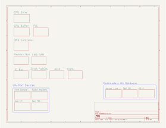

# Vega816 - DMA Arbitration and VPB Rewrite for BB816 Breakout

The Vega816 is a SMP (Symmetrical Multiprocessing) architecture for Adrien Kohlbecker's 65816
Breakout Board, part of Adrien's astonishingly meticulous BB816 project. 
Hereinafter, unless otherwise specified, "CPU" refers to the W65C816S as wrapped 
in Adrien's W65C816 Breakout Board, or other device (e.g. GPU) made to expose relevant features of
the same interface. The current schematics reference BB816 Breakout Board Revision A.27.

The Vega816 allows up to four CPUs or other bus mastering devices shared access 
to up to four DMA channels, designated DMA0 to DMA3. Each DMA channel provides a
full 16 MB of address space. To ensure that each CPU has its own independent Bank Zero
at startup, each CPU has an independent physical DMA channel as its own "home" DMA0,
with the remaining channels numbered in circular fashion. 

As an independent feature, Vector Pull Rewrite is implemented, providing up to 8 separate
possible IRQ vectors, IRQB0-IRQB7. When an IRQ is asserted on one of the eight provided IRQ inputs,
a priority encoder calculates a three bit offset, and adds double this number to the address
being fetched by the CPU when an IRQ Vector Pull is detected (vectors occupy two bytes, accounting
for the doubled offset used to fetch both bytes). 

The Vector Pull Rewrite Feature works in either Emulation or Native mode.

## Implementation Details

Each CPU is mounted in a "CPU Shim", with identical input and output connectors each wired to 
the BB816 Breakout Board standard. The CPU Shim provides hardware hooks for connecting a DMA Controller,
and eight separate IRQ inputs used by the IRQ Priority Vector Pull Rewrite feature, which is 
also provided by the CPU Shim. 

Both the DMA Control section and the Vector Pull Rewrite section
may alter input and output between the CPU and the bus. For example, since the DMA process 
may result in a change to A23-A22, the BANK0B line is recalculated, so that the value on the bus
reflects whether Bank Zero is being requested on the destination DMA channel.

The CPU Shim is mounted on the CPU Buffer Board, which buffers access between the CPU and one out of 
up to four physical DMA channels. Each DMA channel on the buffer board replicates the full 
BB816 Breakout Board interface. Any hardware built to accept a BB816 Breakout Board 
as its CPU can be attached to a DMA channel without modification. 

The CPU Buffer takes a 1-of-4 input which switches on one of the four physical DMA channel
buffers. 

When not enabled, each DMA channel is in a high impedance state. This allows the buffer 
boards to be "stacked": DMA channels from separate boards may be physically connected 
together so that multiple CPUs share multiple DMA channels. If very long/tall pin headers
are installed, the boards may be physically stacked one atop another. 

When DMA requests are not enabled for a particular CPU, it will always request DMA0. 
When DMA requests are enabled for a particular CPU, the lines A23 and A22 are
decoded as the requested DMA channel and passed to the DMA Controller, along with a priority bit
setting.  

A four channel DMA Controller accepts requests from up to four CPUs, and uses priority decoding
logic to assign CPUs to DMA channels on each clock cycle. A CPU which does not
"win" access to its requested DMA channel is "paused" for one cycle. A pulse is
applied to that CPU's READY_IN, causing it to pause until the falling edge of the next
clock cycle.

Under ordinary circumstances, a CPU always wins priority access to the DMA 
channel that it has designated DMA0. If another CPU (GPU) needs access to
another CPU's DMA0, it will be paused, unless it also has asserted a "Priority Bit"
to the DMA Controller. In that case, the CPU whose home DMA0 channel has been
requested by the visiting CPU will be paused, instead, and the visiting
CPU will be granted access. This feature supports real time applications 
such as VIC-II and World's Worst Video Card style DMA.


Each CPU is mounted on a CPU Shim, consisting of a DMA Shim and Vector Pull Rewrite Shim.

The DMA Control Shim monitors CPU address lines and, when the CPU is in Native mode,
issues DMA requests to the DMA Controller. The DMA Controller performs bus arbitration among
the installed CPUs. If a CPU wins access to a DMA channel for a given clock cycle,
its DMA Control Shim receives the go-ahead from the DMA Controller, and switches on the
correct channel on the CPU's CPU Buffer. Otherwise, the DMA Control Shim pauses its
CPU, by asserting RDY_IN low.

The Vector Pull Rewrite Shim allows eight levels of IRQ priority from 0-7. Priority 7 may be 
rerouted to perform NMI instead. When one of the IRQ inputs not designated for NMI
is pulled low, the VPB Rewrite Shim pulls IRQ low on the CPU, and
monitors VPB and A0-A8 to detect when the interrupt vector is pulled by the CPU in response.
The VPB Rewrite Shim then modifies the fetched vector's address by adding an even number
offset between 0 and 14 to the vector fetch address. The number is calculated as twice the
highest IRQ Priority of the current asserted IRQs.
    
## Functional Description


The Vega816 is a modular architecture for implementing symmetrical multiprocessing (SMP) with the Western Design Center W65C816 Microprocessor (aka 65816). The project takes as its starting point the 65816 breakout board designed by Adrien Kohlbecker, documented at [the project's GitHub page](https://github.com/adrienkohlbecker/BB816) as well as [Adrien's YouTube series](https://www.youtube.com/playlist?list=PLdGm_pyUmoII9D16mzw-XsJjHKi3f1kqT).

Support is provided for up to four bus mastering devices (four CPUs, or three CPUs and a video card) accessing up to four DMA channels. Each DMA channel has full 24 bit addressing and therefore 16 MB of address space.

Through the use of software programmable banking registers, all four CPUs share access to all four 16 MB DMA channels, for a total of 64 MB of shared memory.

The architecture can be extended in a star pattern to form massively parallel networks, by connecting one DMA channel from one node as an input CPU channel on a higher-order node in the hierarchy.


The DMA Control shim provides movable jumpers for each of the bits A16-A23. Any of the bits may be selected as DMA_REQ. Once the jumper has been set to select one of those lines, it is connected as the DMA_REQ output, and disconnected from output to the DMA end, and is in fact pulled low on the DMA end (10K resistor), in order to map the request into a lower part of the DMA channel's address space.

The jumper offers the user a choice of granularity of DMA channel address mapping, in multiple of 2 increments from 64K (single bank, the minimum granularity) to 4M maximum. This allows for the address space to be contiguous across all DMA channels, depending on installed memory sizes. Ordinarily, this jumper should be set to the size of the maximum address space serviced by the hardware on either DMA channel, e.g. the total installed memory on that channel, or half the total memory across the two channels.

# Vector Pull Rewrite 

The Vector Pull Rewrite feature allows the IRQ Dispatcher to alter the fetch address of the processor when it is fetching an IRQ vector. A three bit number between 0-7 is added to the least significant bits (but one) of the fetch address, A1-A3, with carry into A4.

The VPB line is brought active low by the 65C816 during the fetch of any interrupt vector, not just IRQ. However, the standard IRQ vector's address has a unique bit pattern which makes it easy to autodetect, so that the shim will only request a vector pull offset when fetching the IRQ vector, and not for any other kind of interrupt.

When VPB is active (low) and A1-A3 are all high, indicating that an interrupt vector is being fetched by the processor, the shim requests a vector pull offset from the IRQ Dispatcher by asserting VP_REQ (positive logic). Pulldown resistors keep the offset equal to zero when Y0-Y2 are not connected (no IRQ Dispatcher) or in a high impedance state. 

A 74HC283 adder is used to add an offset to A1-A4 equal to the three bit number provided as input to the shim from the IRQ Dispatcher, on pins Y0-Y2. This has the effect of altering the fetch of the IRQ vector at $FFEE to a fetch of a vector at one of the following eight addresses: 
```
$00FFEE IRQ 0 
$00FFF0 IRQ 1 
$00FFF2 IRQ 2 
$00FFF4 IRQ 3 
$00FFF6 IRQ 4 
$00FFF8 IRQ 5 
$00FFFA IRQ 6 
$00FFFC RESET 
```
Y0-Y2 are pulled low by 10K resistors, for cases in which no Vector Pull controller is connected. Bypass jumpers are also provided for A1-A4, in case the 74HC283 adder and supporting logic are not installed.

The connector for the external Vector Pull Rewrite controller provides the E signal from the CPU, so that the Vector Pull Rewrite controller can know which scheme of vector pull (W65C02, W65C816) is being used.

#### Exposure of NMI and IRQ

The Vector Pull Rewrite shim exposes both IRQ and NMI to the IRQ Dispatcher. 

If the IRQ Dispatcher is not installed, a jumper on the Quad 64 IO Bus (IRQ Dispatch Bypass) should be installed to route IRQs to the common IRQ signal on the CPU via the CPU Buffer's DMA Channel connector.

When the IRQ Dispatcher is installed, the dispatcher takes responsibility for issuing IRQ to the CPU, via the Vector Pull Rewrite shim.

The exposure of NMI allows a device to raise an  IRQs at a selected IRQ priority level (say, IRQ 7) and instead trigger NMI, as the Commodore 64 RESTORE key did. The assertion of NMI is left under the control of the IRQ Dispatcher.

In scenarios where the IRQ Dispatcher is not installed, a jumper on the Quad 64B IO Bus (NMI Dispatch Bypass) can be used to direct IRQA7, IRQB7, both, or neither, to NMI.

#### Offset of 7 triggers RESB interrupt handler for W65C816

Note that, when the 65816 is running in native mode, if an IRQ priority of 7 (0x111) is asserted on Y0-Y2, the vector offset will result in the RESET vector being pulled. Since no actual hardware reset has occurred, if the reset handler relies on a hardware reset having taken place, unpredictable state may occur. It is generally advised to avoid the use of IRQ priority 7 when the CPU is in native mode. Alternatively, IRQ priority 7 may be rerouted to NMI, either through the IRQ Dispatcher, or a jumper on the Quad 64B IO Bus.

#### Details of Vector Pull address rewriting
The W65C816 datasheet gives this table of interrupt vectors which lie between $00FFE4 and $00FFFC
```
Address Function Last Octet (binary)
$00FFE4 COP      0x1110 0100
$00FFE6 BRK      0x1110 0110
$00FFE8 ABORT    0x1110 1000
$00FFEA NMI      0x1110 1010
$00FFEE IRQ      0x1110 1110
$00FFFC RESET    0x1111 1100
```
The datasheet also specifies that when the 65C816 is addressing an interrupt vector, it pulls its VPB line low. This is to allow the system to override the fetched interrupt vector with any other. 

VPB is pulled low for any interrupt vector fetch, not just IRQ, but the present design purposefully limits Vector Pull rewriting to only those cases when IRQ is the vector being fetched.

Note that the last nybble of each of the standard interrupt vectors is unique, which aids in designing a hook for any one of them (the same is true for 6502 Emulation mode, see below). A test of these four bits suffices to uniquely identify the vector being pulled. In particular, both bytes of the two-byte IRQ vector ($FFEE and $FFEF) are the only two bytes in this table with $E or $F (0x1110, 0x1111) as the last nybble of address, i.e., A1-A3 high.

Note also the gap of 12 bytes between the IRQ vector and the RESET vector. Since each vector occupies two bytes, this gap provides sufficient space to specify six (6) additional vectors. 

```
$00FFE4 COP	
$00FFE6 BRK
$00FFE8 ABORT 
$00FFEA NMI 
$00FFEE IRQ 0 
$00FFF0 IRQ 1 
$00FFF2 IRQ 2 
$00FFF4 IRQ 3 
$00FFF6 IRQ 4 
$00FFF8 IRQ 5 
$00FFFA IRQ 6 
$00FFFC RESET 
```
If an offset 0-6 is added to A1-A3, (leaving A0 as found), then the vector fetched will be as shown above, going forward from IRQ0.

#### Effect of Vector Pull Rewrite in Emulation (65C02) Mode
The 6502's IRQ vector, like its 65816 counterpart, has 0x111x in the last nybble, so it is detected by the Vector Pull Rewrite Shim. 
```
$FFFA NMI
$FFFC RESB
$FFFE BRK/IRQ 
```
Unlike the 65816's IRQ vector, the 6502 IRQ vector occurs at the very top of its page, so additions of 1-7 to the bits may force A4 to overflow to 0 (no carry). In particular, $FFFE + $02 = $FFE0, etc. This means the augmented
IRQ vector map for the 6502 looks like this:

```
$FFE0 BRK/IRQ 1
$FFE2 BRK/IRQ 2
$FFE4 BRK/IRQ 3
$FFE6 BRK/IRQ 4
$FFE8 BRK/IRQ 5
$FFEA BRK/IRQ 6
$FFEC BRK/IRQ 7
...
$FFFA NMI
$FFFC RESB
$FFFE BRK/IRQ 0
```
## IRQ Dispatcher

Devices mapped within the physical address space of either DMA channel may raise interrupt requests against either CPU. For each CPU, an 8-to-3 priority encoders is used to prioritize eight different levels of IRQ, from 0-7, with lower values meaning higher priority.

The priority is encoded as a three bit offset, and this value is added to A1-A3, effectively adding double the offset to the address to be pulled. (Double, since each vector occupies two consecutive bytes)

IRQs received from DMA channel 0 and intended for CPU A or CPU B will be routed to those CPUs. 

For IRQs received from DMA channel 1, the situation is reversed: IRQs which DMA channel 1 intended for CPU A will be routed to CPU B, and vice versa. This crossover in routing means that the CPU target values in the system's PIC controllers always refer to the same physical CPU. I.e., CPU A is always target 0, and CPU B is always target 1, no matter on which DMA channel a PIC is installed. The crossover is reflected in the connector placement on the IRQ Dispatcher: no crossover cable is needed.

### IRQ Priority 7 to NMI Option

A jumper on the CPU Shim allows IRQ7B to trigger NMIB instead of participating in Vector Pull Rewrite.
This is intended to support devices such as the RESTORE key on the C64, which expects to be able to
assert NMIB.

# DMA Controller

The DMA Controller is intended to control the multiplexing of one or two CPUs (called CPU A and CPU B) onto one or two communication channels (called DMA 0 and DMA 1). The two channels are cross-mapped in address space from the point of view of opposite processors, depending on a selected granularity. For example, if 64 KB (single bank) granularity is selected, when CPU A requests Bank 0, the DMA controller will connect it to DMA channel 0, whereas if CPU A requests Bank 1, the controller will connect it to DMA channel 1. The situation is reversed for CPU B. The controller will direct its requests for Bank 0 to DMA channel 1, and requests for Bank 1 to DMA channel 0.

This permits each CPU to have its Bank 0 lie within the address space of a separate physical DMA channel, so that accesses by each CPU to its own Bank 0 will not normally interfere with the opposite CPU's requests for its own Bank 0.

The effect for higher memory is that each CPU's odd numbered banks are the other CPU's even numbered banks, interleaved to the top of physical memory.

The granularity of the interleaving is specified by a jumper on the DMA Controller Shim, and provided to the DMA controller as the signal DMA_REQ. Additionally, the following CPU signals are utilized in implementing DMA:
```
RDY_IN
ABORTB
VA
```
Since the DMA controller will dispatch requests from up to two CPUs, CPU A and CPU B, the signals are distinguished within the controller with these designations:

Inputs
```
DMA_REQB_A DMA_REQB_A
RDY_IN_A  RDY_IN_B
ABORTB_A  ABORTB_B
VA_A      VA_B
```
Since the DMA channels are cross-mapped in address range between the two CPUs, so that each CPU's DMA 0 corresponds to the lower part of its address space with respect to DMA 1, the outputs are:
```
DMA_0_A  = DMA_1_B
DMA_1_A  = DMA_0_B
```
This cross mapping, which takes place in the connector wiring of the DMA Controller board, means that two identically configured units may be connected as CPU A or CPU B, provided that their DMA buffer modules are connected with the sense of DMA 0 and DMA 1 reversed.

The "home" channel for a CPU is the DMA channel containing that CPU's Bank Zero.

Here are the possible scenarios for DMA arbitration:

1. Both CPUs are asserting valid address, each against their own home DMA channels. CPU A is using DMA 0, and CPU B is using DMA 1.
2. Both CPUs are asserting valid address, against the opposite CPU's home DMA channel. CPU A is asserting against DMA 1, and CPU B is asserting against DMA 0.
3. Both CPUs are asserting valid address against the same DMA channel. CPU A is asserting against DMA 0, and so is CPU B.
4. Both CPUs are asserting valid address against the same DMA channel. CPU A is asserting against DMA 1, and so is CPU B.


The DMA controller monitors the VA (Valid Address) from one or two CPUs, as well as an additional input, DMA_REQB. If one CPU asserts DMA_REQB, the controller checks the VA line from the opposite CPU. If it is not active, the controller asserts DMA


### DMA Channels and Address Interleaving

When no request granularity is set for a CPU on the DMA Control Shim, all DMA requests take place against DMA 0.

If only the primary granularity is set, DMA requests will take place against DMA 0 and DMA 2.
If only the secondary granularity is set, DMA requests will take place against DMA 0 and DMA 1.

If both granularities are set, DMA requests will take place against DMA 0-3. The maximum granularity for four channel DMA is 4 MB, with primary set at 8 MB and secondary set at 4MB. (0x1100 0000). In that case,

```
Requests for the range 
(0x00?? ????) go to DMA channel 0
(0x01?? ????) go to DMA channel 1
(0x10?? ????) go to DMA channel 2
(0x11?? ????) go to DMA channel 3
```

The DMA controller maps requests so that each CPU sees a different DMA channel as its channel 0, with subsequent channels in order. The next CPU's channel 0 is the present CPU's channel 1, and channel 0 for the next CPU after that is channel 2. The order wraps to form a closed ring.

```
           Requested           Physical
CPU   A    B      C      D
      0    1      2      3      DMA 0
      1    2      3      0      DMA 1
      2    3      0      1      DMA 2
      3    0      1      2      DMA 3
```

From the chart it can be seen that the channel that CPU A sees as DMA 0 is seen by CPU B as DMA channel 3, etc.


DMA request granularity may or may not match the largest installed address size.

Since the address bits used to select the DMA channels are suppressed in the address presented to the destination channel, if a CPU's request granularity is set to a smaller value than the installed memory size on any given DMA channel, then a range of that memory will not be accessible to that CPU.


CPU A has primary DMA on 1M, and secondary DMA set to 512K. 
CPU A issues requests against Banks 0 to 7.

What DMA channels are addressed?

```
0x000 Bank 0x000 0 on DMA 0
0x001 Bank 0x000 0 on DMA 1
0x010 Bank 0x000 0 on DMA 2
0x011 Bank 0x000 0 on DMA 3
0x100 Bank 0x100 4 on DMA 0
0x101 Bank 0x100 4 on DMA 1
0x110 Bank 0x100 4 on DMA 2
0x111 Bank 0x100 4 on DMA 3
```

### How the DMA Controller routes requests

Each request enters the DMA controller as a two bit code, representing the two address lines selected by jumper settings on the DMA Control Shim. These two bits are augmented with a third bit, a CPU Priority bit supplied for that CPU. The CPU Priority bit is active low, and pulled high. 

The three bit request is decoded into a one in eight choice, each representing a request for one of four DMA channels, with and without priority. The eight decoded request lines are then routed, together with the decoded request lines from the other CPUs, into priority encoders, one for each of the four DMA channels. The eight request lines entering each DMA channel's priority encoder are wired so that the four priority requests occur with highest priority, followed by the four no-priority request lines. Among the two sets of priority requests, Each DMA channel gives greatest priority to a particular CPU, followed by the others in ring order.

```
DMA Channel   Order
     0        ADCB                  
     1        BADC            
     2        CBAD
     3        DCBA            
```

When more than one CPU requests the same DMA channel, the losing CPU(s) must be informed, since they will not have access to the DMA channel for the duration of the current clock cycle. 

The W65C816 provides two mechanisms for this, the READY signal, and the ABORTB interrupt signal. The READY signal pauses the processor, if pulled low. Releasing the low condition, allowing READY to return high, will cause the CPU to resume processing on the rising edge of the next clock cycle.

Adrien Kohlbecker's BB816 CPU breakout provides the input to the READY signal as RDY_IN. This signal is that which is used by the DMA Controller to pause the CPU.

If the losing CPU is losing access to its Bank Zero channel (due to the winning CPU having priority bit active), the losing CPU is paused, by pulling RDY_IN low. 

Any other losing CPU is informed by pulling the losing CPU's ABORTB low, triggering the losing CPU's ABORT Interrupt handler. In most cases, the handler will simply return control to the interrupted process so that another attempt at access to the DMA channel can be made on the next clock cycle.


### DMA Request timing


CPU to DMA routing must be complete, with time to spare for the devices on the DMA channel to decode incoming address, before the routing is latched in on the falling edge of the clock. Now latched, the CPU to DMA channel routing persists through the remainder of the clock cycle, until unlatched at the rising edge of the clock at the beginning of the next cycle, so that arbitration may begin again.

